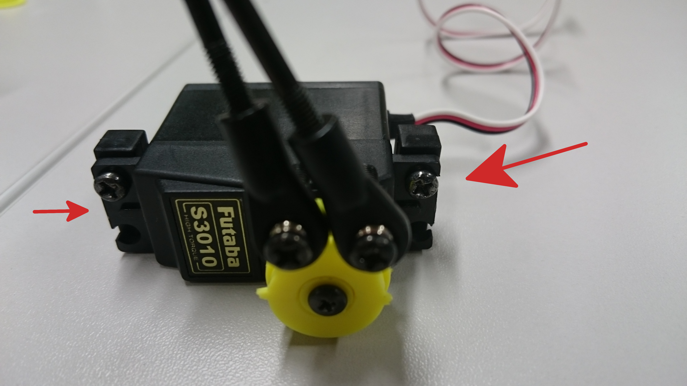

.. _assembly_section_lbl:
How to assemble your Freescale Cup car
======================================

The car provided to you requires some assembly before you're able to properly use it in the competition. In particular, you will need to add the servo, the FRDM-KL25Z board and the camera, on a custom made mount.

Please note that this document is meant only to guide you and presents only one way to build everything together. If you are so inclined, feel free to change things as you like, especially for the board and camera mount. However, do keep in mind that:

* You will need to connect the camera, servo and battery pack to the FRDM-KL25Z board;
* All the components should be tightly fitted to the car so they won't get thrown off during the actual race.

Inventory
---------

   All the items you should have received

The big box you are given should have the same contents as :numref:`fig:comp_init`: another smaller box, containing the car and more, the camera board, the camera lens and some cables, the servo, the FRDM-KL25Z board and a USB cable.

.. figure:: Pictures/03-02Components2.jpg
   :alt: Contents of small box
   :align: center
   :name: fig:comp_init_car

   Contents of the small box

The contents of the smaller box are the actual car, a bag with screws, nuts and more and a second bag with pieces to help you assemble your car. The screwdriver is not included, but you will need it to get everything together.

Installing the servo
--------------------

The first step is installing the servo. This process is more or less set in stone, but there are certain points where you can get creative.

First, take out the servo and the four yellow plastic pieces presented in :numref:`fig:serv_comps`. Note that you might have **multiple** yellow gears. If you look closely, they should have two letters on them, indicating which servo maker they work for. Look on the servo to find the maker's name, then the five possible letter combinations on the gear are HI (Hitec), FU (Futaba), SP (Spare), JR and SA (Sanwa).

   Pieces required to replace the servo gear

Then, combine the yellow parts as below:

.. figure:: Pictures/03-04ServoYellow.jpg
   :alt: Combined yellow parts
   :align: center

   The replacement servo gear put together

Unscrew the black connector from the servo and replace it with the yellow one you just made. Use the same screw and remember to add in the small yellow piece to fasten everything together. It is important to insert the new connector aligned; for our particular servo, you can see a correct alignment in :numref:`fig:servo_repl`; notice how the part sticking out is perpendicular with the servo placed sideways. Not inserting the mechanism correctly will only be noticeable when you zero the servo later on using Simulink.

   Dissassembled servo

.. figure:: Pictures/03-06ServoReplaced.jpg
   :alt: Servo gear replaced
   :align: center
   :name: fig:servo_repl

   Servo with gear replaced

The next step is to assemble the axles connecting the servo to the wheels. The pieces you need are shown in :numref:`fig:axle_pieces` and the expected result is in :numref:`fig:axle_assemble`.

   Pieces required to assemble the axles

   Assembled axles

We also need to insert the bearings in the open end of the axles, as shown in :numref:`fig:axle_bearings`.

.. figure:: Pictures/03-09AxleBearings.jpg
   :alt: Assembled axles with bearings
   :align: center
   :name: fig:axle_bearings

   Assembled axles with inserted bearings

Once we have our assembled axles, we need to assemble them with the servo. For this, we use two screws and two nuts to fasten them.

   Pieces required to attach axles to servos

.. figure:: Pictures/03-11ServoAxlesAssemble.jpg
   :alt: Servo with the axles attached
   :align: center
   :name: fig:servo_axle_attach

   Servo with the axles attached

The last step is to actually put the servo on the car. Gather the items from :numref:`fig:servo_car_comps`, add the plastic blocks to the servo block (:numref:`fig:servo_car_blocks`), then insert the servo in its slot, towards the front of the car (:numref:`fig:servo_car_insert`). Finally, fasten it in place with screws on the underside of the car (:numref:`fig:servo_car_bottom`).

   Pieces required to attach the servo to the car

   Attaching the plastic blocks to the servo

.. figure:: Pictures/03-14ServoCarInsert.jpg
   :alt: Inserted servo
   :align: center
   :name: fig:servo_car_insert

   Servo inserted in its socket in the car

   Screws securing the servo on the car

Installing the FRDM-KL25Z board
-------------------------------

You can choose to put the board anywhere you wish, but there are certain important considerations you need to keep in mind:

* the battery block, the camera and the servo have cables that must be inserted into the board;
* it is very *important* that you insert the cables correctly; inserting them the wrong way can short-circuit your car board;
* the board itself should be fitted firmly, so it cannot be thrown off during the actual race.

You can see an example in :numref:`fig:board_fitted`. This particular method is not great, as the board is wobbly, possibly affecting the car's balance during the race. However, the position should be reached by all the cables and it is secured to the car.

   Board fitted to the car

:numref:`fig:cabling_battery` and :numref:`fig:cabling_front` show you how the cables from the battery block (first picture) and servo (second picture) should be inserted. Note that the black cable should be on the right. However, we suggest you ask an expert, if available, to ensure everything is fine. As we said, putting them in the wrong way can lead to short-circuiting your board and is very dangerous.

   Battery cables going into the board

   Camera and servo cables

Putting together the camera and building a mount
------------------------------------------------

The first part is fairly straight-forward: screw the camera lens and the sensor together (:numref:`fig:camera_parts` and :numref:`fig:camera_assemble`).

   Required camera parts

   Assembled camera

The second part is completely up to you. You must build a mount for the camera, from whatever items you have available. We provide some guiding images that might help you, but note that you might not have similar materials available. Some guidelines for making a good mount:

* make sure it's stable and well-attached to the car. Again, in the actual race, your car might be going fast, so it is a possibility that the mount might be thrown off. Make sure you test it thoroughly;
* the camera should be facing downwards, looking in front of the car. You want to be able to see what's coming and adjust your controls accordingly. How far you want to see is up to you, but make sure the camera is placed such that it can see the track and any guiding lines.

Some examples of mounts can be found at the following links:

* `two examples on the Freescale Community website <https://community.freescale.com/docs/DOC-1018>`_
* `a very simple example with zip ties <https://community.freescale.com/videos/1567>`_

   An example camera mount

Additional resources
--------------------

You can find more resources available on the corresponding `Freescale community website page <https://community.freescale.com/docs/DOC-1014>`_.
