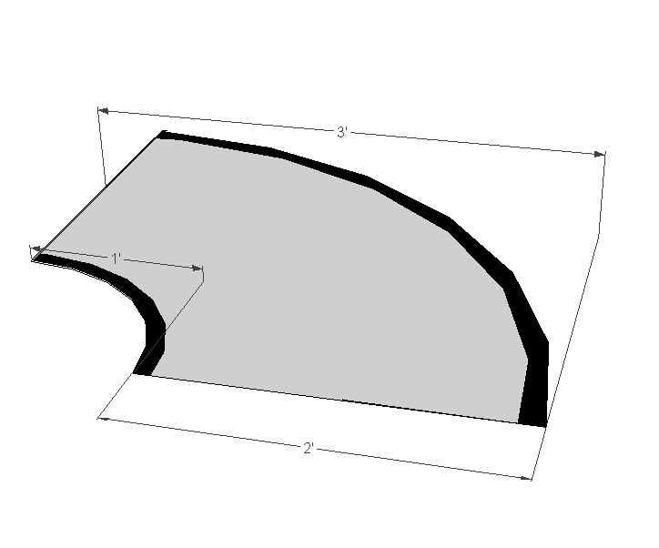
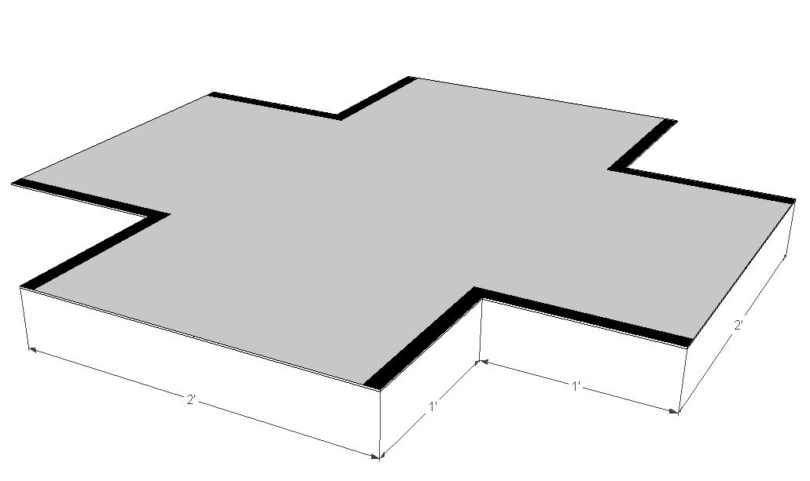
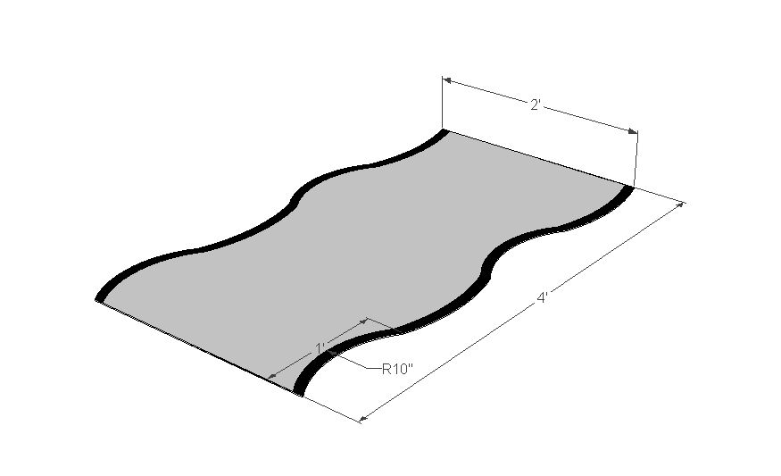
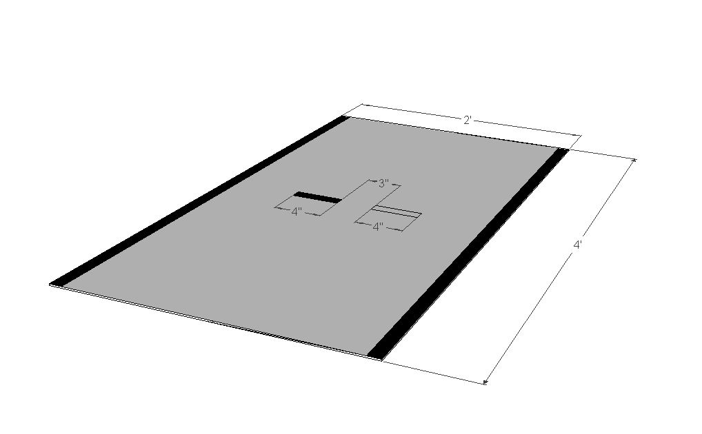
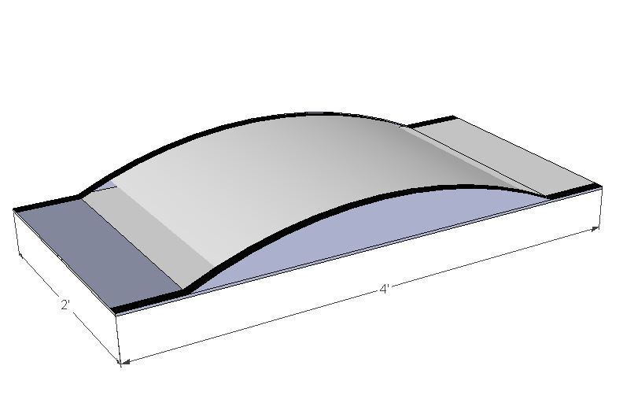

Freescale Cup
=============

The Freescale Cup is a worldwide student competition, which enables students to learn about embedded systems and control.
The objective of the competition is for students to learn how to assemble, program and race a car on a track.
At the same time, the assembled car should be able to run as fast as possible without diverging from the track.
The winner of the competition is the team with the fastest car.

Students will build a motor control hardware by utilising the parts included in the Freescale entry kit.
Through the use of Embedded software programming students will be able to steer and control their cars.
Since the car must race on the track at all times, students should use a camera to detect and follow the guide line.

The track
---------

The track is made from 1/16 inch ABS Plastic with a background colour of white matte. The track is bounded with matte black stripes. Models of the track are illustrated in Figures 5-6.

   Qtr. Turn

.. figure:: Pictures/02-Straight_EdgeLine.JPG.jpg
   :scale: 50 %

   Straight track segment

   Intersection

   Chicanes

   Finish / Start trach segment

   Hill

Rules
-----

Rules vary from region to region. For this reason you are advised to read the rules for your region, on the Freescale Cup `competition page <https://community.freescale.com/docs/DOC-93225>`_.
Some of the rules that apply for any region are:

	1.	Teams should have a maximum size of 3 and a minimum size of 2.
	2.	A team can only have one graduate student (Master’s student).
	3.	All teams should register online in order to participate.
	4.	All vehicles should be inspected before racing on the track.
	5.	A random drawing will be used to determine the race order.
	6.	Only one team member should be on the track at any time.
	7.	Time starts and ends when the first part of the racing car breaks the start/finish line.
	8.	No score is assigned to disqualified or failed teams.
	9.	Fouls add time to a competing car’s time.

Please note that this is not a set of complete rules. You are strongly advised to read the `rules page <https://community.freescale.com/docs/DOC-93225>`_ as rules differ according to the region.
