Intro to the Freescale Cup
==========================

The Freescale Cup is a worldwide student competition, which enables students to learn about embedded systems and control.
The objective of the competition is for students to learn how to assemble, program and race a car on a track.
At the same time, the assembled car should be able to run as fast as possible without diverging from the track.
The winner of the competition is the team with the fastest car.

Students will build a motor control hardware by utilizing parts included in the Freescale entry kit.
Through the use of Embedded software programming students will be able to steer and control their cars.
Since the car must race on the track at all times, students should use a camera to detect and follow the guide line(s).
The cup is run at two levels, a student competition and a competition for university students. A teaser video from
the Malaysia Freescale cup 2015 can be found here:

.. raw:: html

	<iframe width="560" height="315" src="https://www.youtube.com/embed/_UvrPkHNsgE" frameborder="0" allowfullscreen></iframe>

The track
---------

The track is made from 1/16 inch ABS Plastic with a background colour of white matte. The track is bounded with matte black stripes. An example of the whole track is depicted in :numref:`whole_truck`. The main segments of the track are illustrated in :numref:`qtr_turn`-:numref:`hill_edge`. However, the organizers may decide to add more difficult segments such as a tunnels or bumps.

.. figure:: Pictures/whole_truck.jpg
   :scale: 50 %
   :name: whole_truck

   The track - Side black lines

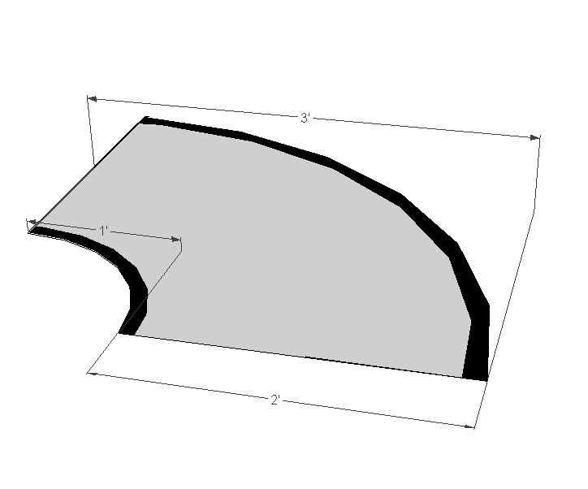

   Qtr. Turn

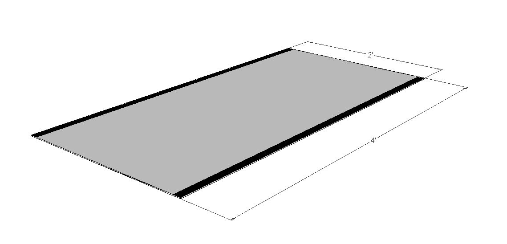

   Straight track segment

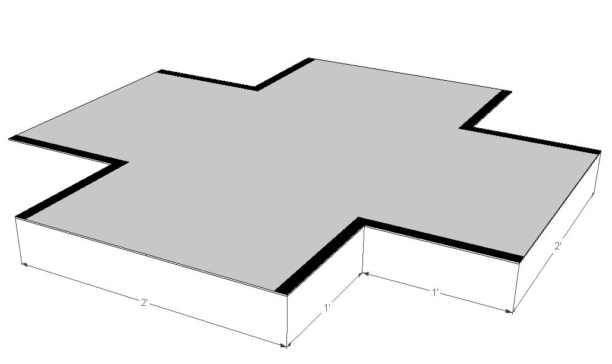

   Intersection

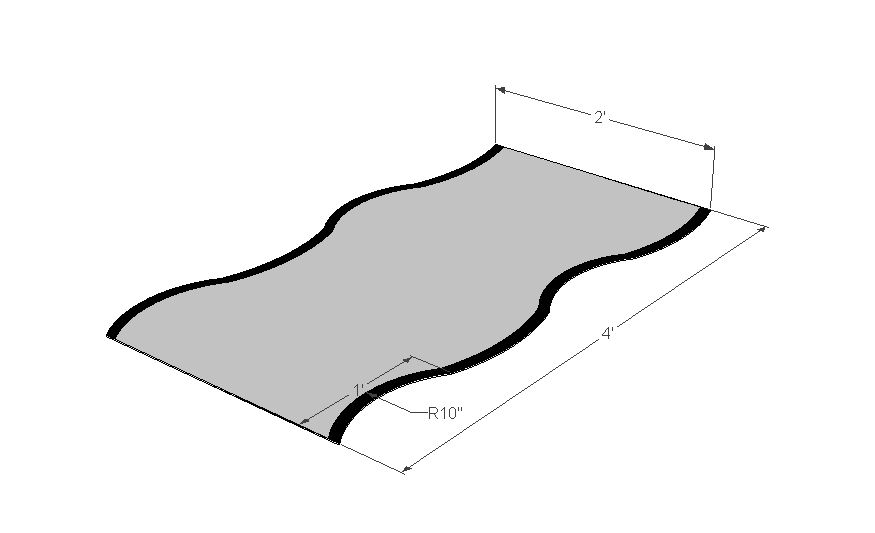

   Chicanes

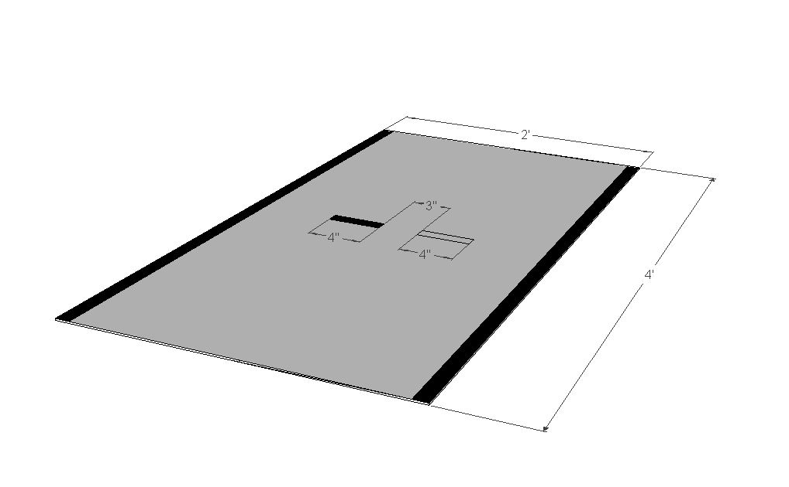

   Finish / Start track segment

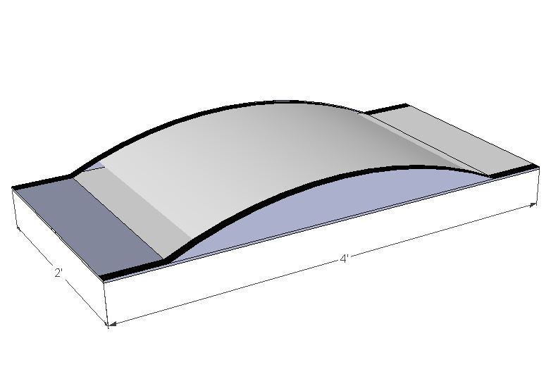

   Hill

Commonly, Freescale cups use another type of track with the black line in the middle (see :numref:`whole_track_middle`).

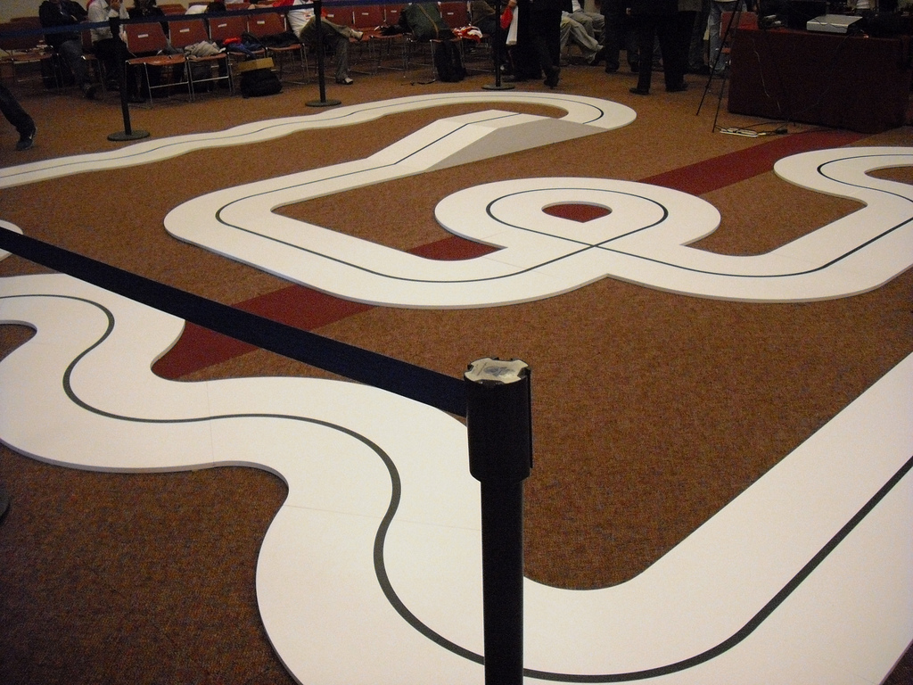

   The track - Black line in the middle
Rules
-----

Rules vary from region to region. For this reason you are advised to read the rules for your region, on the Freescale Cup `competition page <https://community.freescale.com/docs/DOC-93225>`_.
Some of the rules that apply for any region are:

	1.	Teams should have a maximum size of 3 and a minimum size of 2.
	2.	A team can only have one graduate student (Master’s student).
	3.	All teams should register online in order to participate.
	4.	All vehicles should be inspected before racing on the track.
	5.	A random drawing will be used to determine the race order.
	6.	Only one team member should be on the track at any time.
	7.	Time starts and ends when the first part of the racing car breaks the start/finish line.
	8.	No score is assigned to disqualified or failed teams.
	9.	Fouls add time to a competing car’s time.

Please note that this is not a set of complete rules. You are strongly advised to read the `rules page <https://community.freescale.com/docs/DOC-93225>`_ as rules differ according to the region.

The car
-------

This section describes basic parts of the car. Detailed instructions on how to build the car are provided later in this tutorial.

**Chassis**

The chassis of the car is depicted in :numref:`car_chasis`. The wheels are mounted on the car. According to the rules, no modification of the chassis is permitted. During the car assembly, you will place the camera and the FRDM-KL25Z board on top of the chassis.

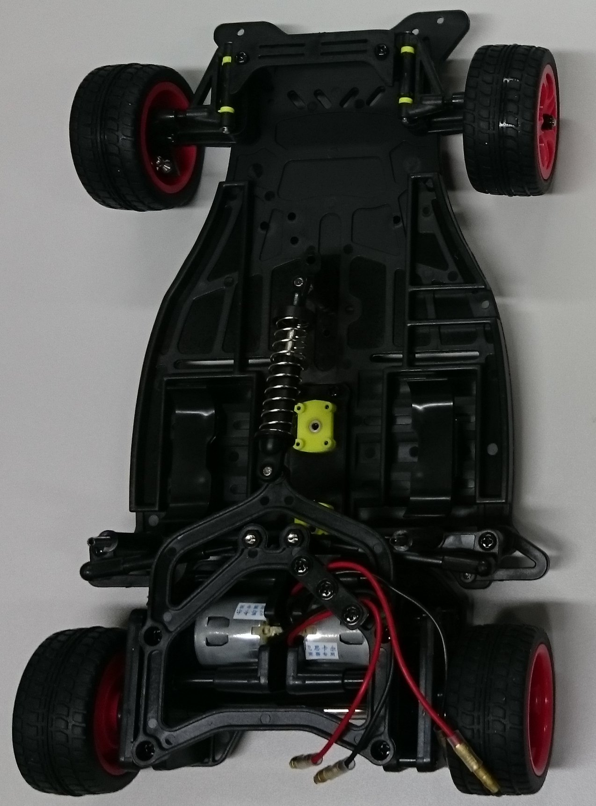

**The Servo Motor**

Servos are devices with an output shaft that are widely used in Robotics and *radio controlled devices*. By supplying to the servo a coded signal, the servo can be placed to different angular positions. Persisting the coded signal on the input line, the servo will retain the angular position of the shaft. Changing the coded signal causes the angular position of the shaft to be changed.

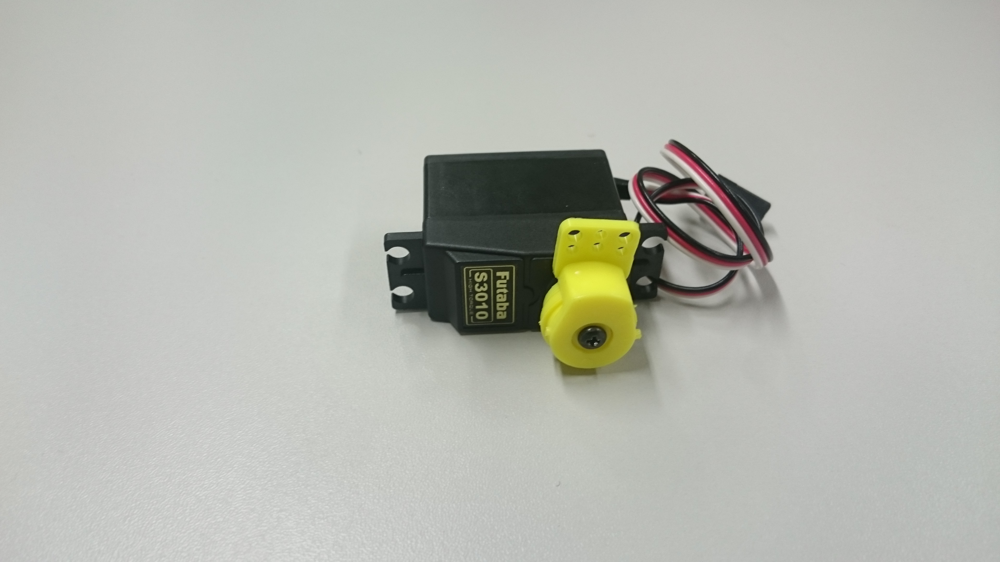

**Steering System**

After assembling the servomotor and attaching it to the chassis, the steering system will look like :numref:`steering_system`. It consists of two control arms attached to a Futaba S3010 servomotor.

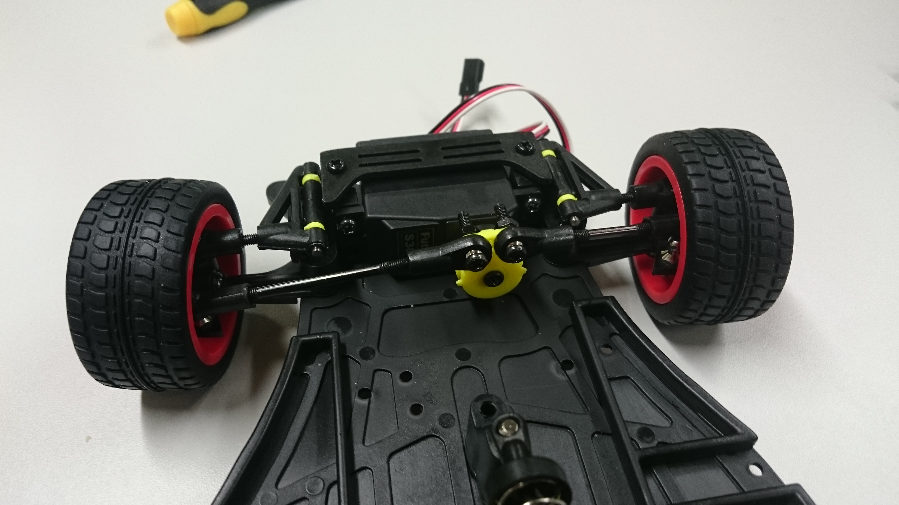

**Camera**

You will also receive a camera (depicted in :numref:`camera`), which you will use to track the lines of the track. You can mount the camera either at the front or the rear of the car.

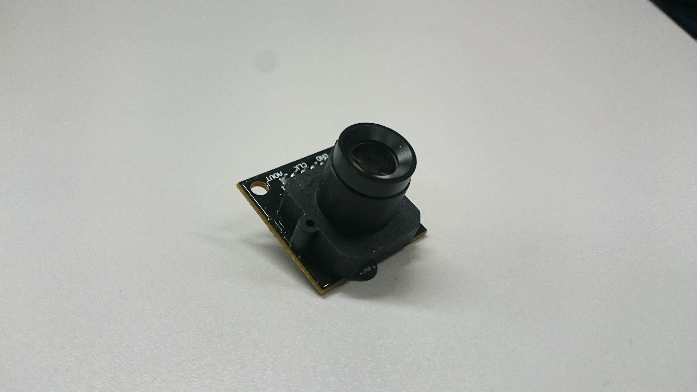

**The motor driver board**

The board (see :numref:`board`) is attached between the two rear wheels of the chassis and above the two DC motors. In this way, you can easily access the speed sensors and the DC motors. You will need to develop a control algorithm to control the speed of the motor.

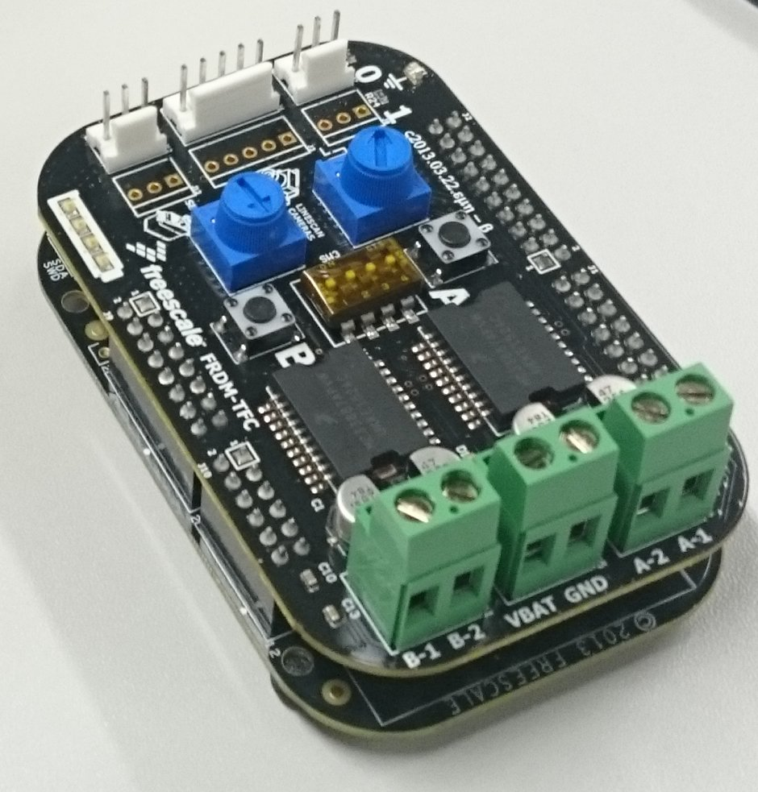

Technical Specifications
------------------------

Describing any technical details of the boards, the servo or the motors is outside the scope of this tutorial. The interested reader is refereed to:

1. `The KL25 Reference Manual <http://www.freescale.com/products/arm-processors/kinetis-cortex-m/l-series/kinetis-kl2x-48-mhz-usb-connectivity-ultra-low-power-mcus:KL2x?fpsp=1&tab=Documentation_Tab#>`_
2. `The Freescale Cup page <https://community.freescale.com/docs/DOC-1284>`_ -- under the *Hardware Concepts* and *Embedded Systems Concepts* sections one can find technical descriptions and tutorials of the DC Motors, the Motor Driver Board and the Servo.

