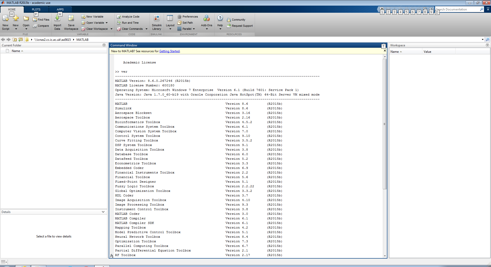
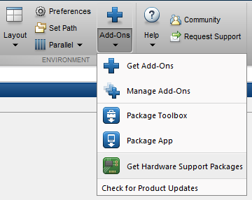
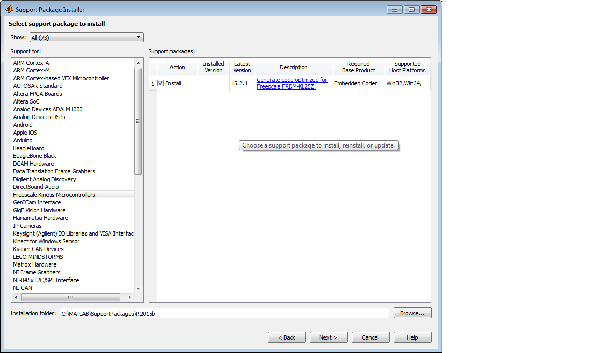
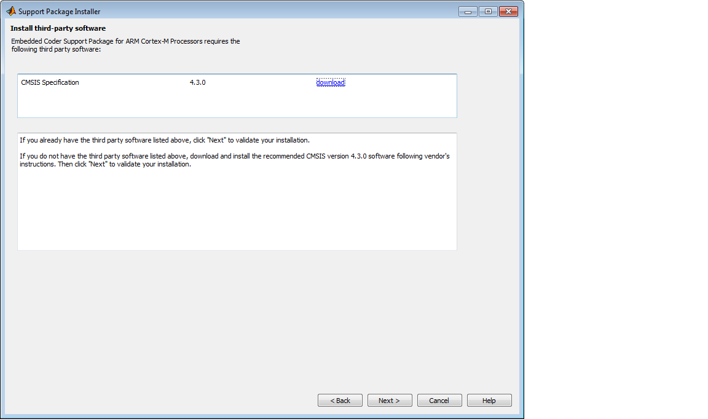
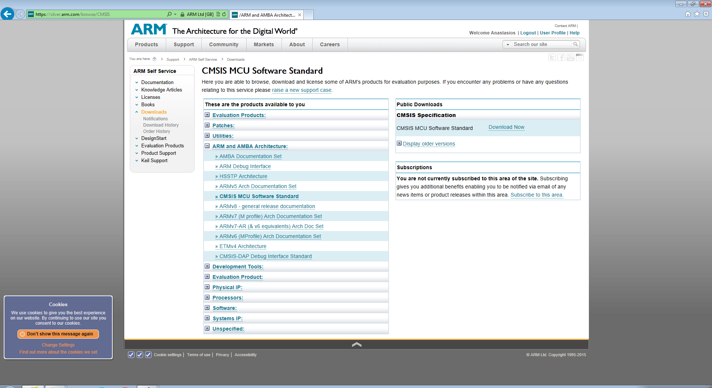

Installation Procedure for Freescale FRDM-KL25Z Board
=====================================================

This is a tutorial on how and what you will need to have in your computer to interact with Freescale’s FRDM-KL25Z Board. **Please read the Prerequisites section carefully before you start.** In general don’t be afraid on using **Google** if you encounter any problems.

Introduction
------------

Before we start with the installation, we would like to give you some general information and links about both Matlab and Simulink.

**Matlab**

Matlab is an environment and a language for numerical computing. For us, we can imagine that it is the shiny powerful engine of our car (not the Freescale car, our real car). We will not interact with Matlab itself in this tutorial, but we need Matlab to make Simulink work for us.

If you want to learn more about Matlab you can find more information `here <http://uk.mathworks.com/products/matlab/>`__. And in general you can use Google and YouTube for various other resources and tutorials.

**Simulink**

Simulink is a Matlab add-on that provides a graphical editor to enable programmers write algorithms and ideas as block diagrams. It simplifies code writing as instead of writing complex programs through lines of code, it gives a graphical interface for you to drag and drop blocks of functionalities.

You can find a lot of information about Simulink `here <http://uk.mathworks.com/products/simulink/>`__. And in general you can use Google and YouTube for various other resources and tutorials.

Prerequisites
-------------

Here is a list of items that you must make sure that exist before you attempt further installation. This is not an optional list and if something is missing you might have complications in the next steps.

* You should use **Windows 7** for your installations. We found that **Windows 8** will not work.
* You need a **Matlab and Simulink License** and a **MathWorks account** with those licenses active.
* We cover instructions only for the **Freescale FRDM-KL25Z Board**.
* We are using **Matlab Version 8.6** (R2015b) and **Simulink Version 8.6** (R2015b).

.. _MatSimInst:

Matlab and Simulink Installation
--------------------------------

1. Go to MathWorks `website <http://uk.mathworks.com>`__.
2. Login with your credentials.
3. Go to **My Account** from the login drop-down menu.
4. Go to **Downloads -> Download Products**.
5. Select the latest version (for us it was 2015b).
6. Choose your operating system (we cover only Windows installations).
7. Be careful to choose the correct architecture of your system (32-bit or 64-bit)
8. Wait for the installer to download (this is not the full Matlab installation, more files will be downloaded on the process).
9. Double click on the installer when it has been downloaded and click *Run* when you are prompt from Windows.
10. Wait until Unzipping is finished (it takes 1-2 minutes).
11. Click *Yes* when you are prompt from Windows in the *User Account Control* window.
12. Now you should be able to see the first page of the MathWorks’ installer.
13. Select Login with your MathWorks’ account and then agree with the license.
14. Login with your credentials.
15. Select your license from the list.
16. Click next to install on the default folder.
17. On the *Select products to install* list, **select everything**.
18. Click Next for all the next questions.
19. Now wait until everything is installed.
20. After the installation is done, make sure that you have *Activate Matlab* check box checked and click next and just follow the instructions.
21. Open Matlab to verify that everything is working properly (see :numref:`install_done`) and you are done! Don’t forget to delete the downloaded files and extracted folders to keep everything clean!

Check that Simulink is installed if you already have Matlab
-----------------------------------------------------------

In case that you have Matlab already installed in your system (e.g. you systems is managed by an administrator from your university/school/organization), you can check if simulink is installed by using the following instructions.

1. Open Matlab.
2. On the **Command Window** type: ``ver``

  - If you see a line writing Simulink, then it is installed.
  - If you don’t see any Simulink line, then download the Matlab installer and follow the previous instructions :ref:`MatSimInst`.

Install Matlab package for Freescale FRDM-KL25Z board
-----------------------------------------------------

1. Open Matlab.
2. Select **Add-Ons** on the menu bar and click **Get Hardware Support Packages**. See Figure 2.

  Figure 2

3. The **Support Package Installer** wizard appears.
4. From the **Select an action** list, select **Install from Internet** and click **Next**.
5. In the **Support Package Installer** wizard, select **Freescale Kinetics Microcontrollers** and then the **FRDM-KL25Z** board.

**HINT:** If you see the package gray and you can not install it, that means that you didn't install Matlab Embedded Coder which can be found in the initial installation.

  Figure 3

6. At some point you are going to be asked to install **CMSIS Specification** software. Click on **download**, then create an **ARM** account and download the software.

**IMPORTANT:** Use version **4.3.0!**

  Figure 4

  Figure 5

7. Extract the software.
8. Click **Next** on the **CMSIS Specification** window and then you will be asked to **Specify the CMSIS installation folder**. Browse to the just extracted folder.
9. For the remaining pages of the **Support Package Installer** wizard, just follow the instructions.

If you find any issues on this step, you can always refer to the official documentation `here <http://uk.mathworks.com/help/supportpkg/freedomboard/ug/install-support-for-freescale-frdm-kl25z-board.html>`__.

Install drivers for Freescale FRDM-KL25Z board
----------------------------------------------

Before you use the Freescale FRDM-KL25Z board with the host computer, you need to install the OpenSDA USB drivers. This is the last step you need to do.

1. Download and Install the P&E OpenSDA USB Drivers from the `site <http://www.pemicro.com/opensda/>`__. Select **Windows USB Drivers**.
2. You should be ready now!

If you find any issues on this step you, can always refer to the official documentation `here <http://uk.mathworks.com/help/supportpkg/freedomboard/ug/install-drivers-for-freescale-frdm-kl25z-board.html>`__.
