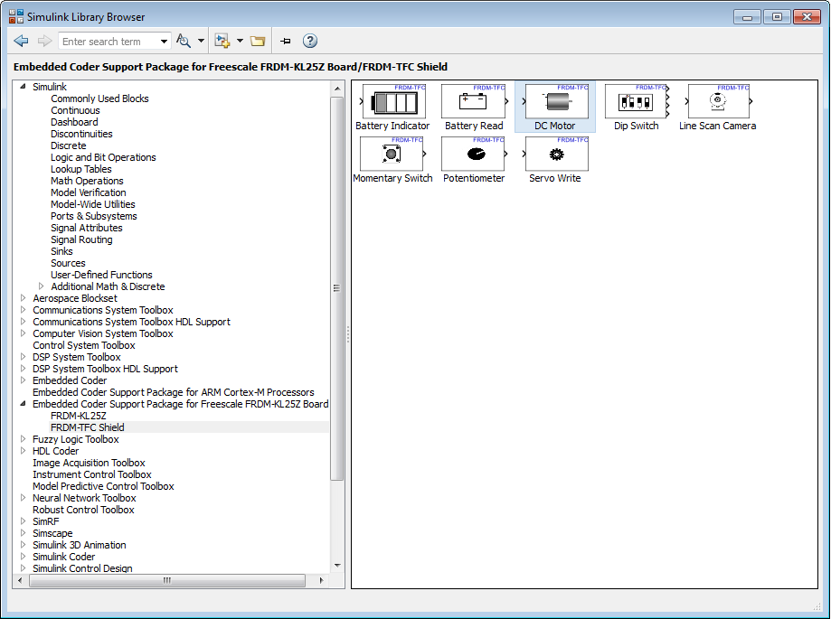
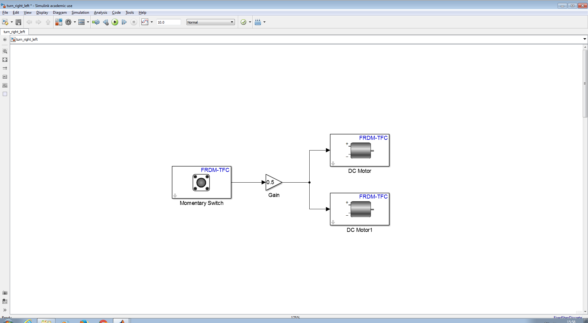
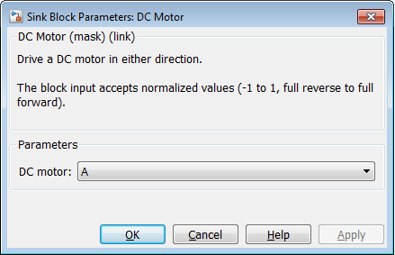
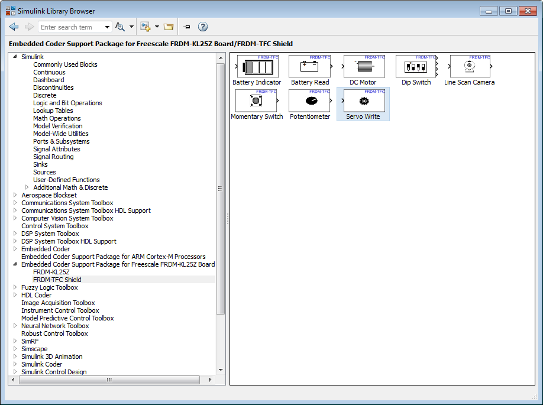
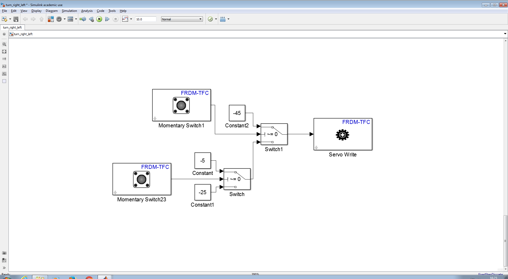
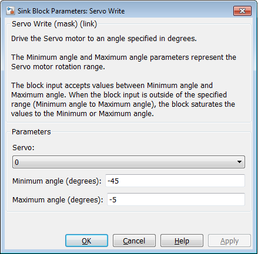

Moving and Steering
===================

Now that we know a little bit more about how to write simple examples in Simulink, lets continue on with a program that uses the rear DC motors and the front servo motor to steer the car.

Using the rear DC motors
------------------------

In this example we will see how we can use **DC Motor** blocks to speed-up or slow-down the car.

1. Create a new Simulink empty model as we have seen in the previous examples.
2. Find the **DC Motor** blocks in **Simulink Library Browser**

  The DC Motor Block

3. For this particular example we created a very simple case that two DC motors start spinning whenever someone push of the Freescale board's buttons.

  Using DC Motors Example

4. By clicking on one of the DC Motor blocks, you can switch and choose which real rear motor you are going to use.

**IMPORTANT:** DC Motors accept a value from -1 to 1 and that is the **acceleration** not the **speed**. By that, we mean that give the value 1 all the time you car will reach the maximum speed, but if you the give value **0** that doesn't mean that the car will stop!

  DC Motor Options

5. In case that -1 is accelerating you DC motor **forward** is because you have a reverse cabling on your board. Just change the cables connecting the motor to the board.

Using the rear Servo motors
---------------------------

In this example we will see how we can use **Servo Motor** block steer the car.

1. Create a new Simulink empty model as we have seen in the previous examples.
2. Find the **Servo Write** blocks in **Simulink Library Browser**

  The Servo Write Block

3. For this particular example we created a very simple case that we steer the front wheels depending on which button we push on the Freescale board.

  Using the Servo Motor Example

4. The reason that we put those strange numbers (-1, -25, -45) on the constants is because the Servo motor is working accepting a specific value which is going to be translated into an angle to turn from point 0. That means that if you put 0 as an input the servo should turn to its initial state. This is important as you might have moved the servo during the construction of your car which means that 0 is not keeping your wheels straight. In our case here we found that to keep our wheels straight we need to give an input of -25.

5. By clicking on the Servo Write block you can see more information and options.

  Servo Write Options
