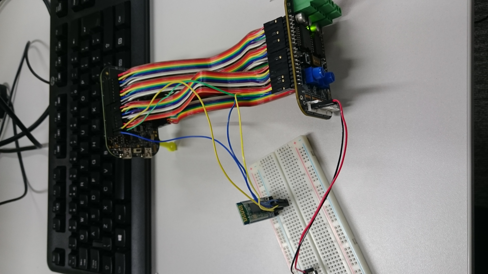

Adding additional sensors to your car
=====================================

We look at how we can program in Simulink a bluetooth transmission device and link it with multiple sensors, to provide real-time data information about various car parameters.

At the time of writing this document, none of the sensors presented here are given with the car; you will have to obtain them yourself. The main component required for this is a bluetooth transmitter that you will have to attach to the board yourself (you can see an example in :numref:`fig:bluetooth`.

An option for a bluetooth transmitter is the HC-05 (which is available on `Amazon <http://www.amazon.co.uk/s/ref=nb_sb_noss?url=search-alias%3Daps&field-keywords=hc-05>`_). You will also need to download the code for the bluetooth transmitter and receiver Simulink blocks, available `here <https://github.com/mattdouthwaite/HiPEDS-Sensors-Group>`_. You will also find blocks for a variety of different sensors.

This guide assumes you have added the bluetooth transmitter to your board and have downloaded the required Simulink libraries.

   A bluetooth transmitter connected to the FRDM-KL25Z board

Using the bluetooth Simulink blocks
-----------------------------------

The bluetooth module only provides a bridge between whatever sensors you link to it and a device of your choice (generall, a laptop). You will need to attach any sensors you would like information from to it, then build two simulink programs: a transmitter and a receiver program.

Transmitter
^^^^^^^^^^^

This represents the hardware on the car itself. The main component should be the Bluetooth transmitter block, taking inputs from your sensors (the number of inputs is configurable). It is up to you to decide what to do with the data recorded by any sensors you will add. You should have some examples downloaded alonside the bluetooth Simulink libraries, but feel free to add your own examples for any sensors you would like to use. This code has to be uploaded to the car.

**ADD IMAGES FOR EXAMPLE TX PROGRAM**

Receiver
^^^^^^^^

This is the code that your receiving device will be runnning. Generally, it should be just displaying the information received via the bluetooth connection from the sensors on the car. This program has to be uploaded to the device you want to use to display the information.

**ADD IMAGES FOR EXAMPLE RX PROGRAM**

Usage
^^^^^

When the bluetooth module is turned on, it goes into a default discoverable state. To make it recognizable, configure the name of the module. Then, use whatever device you want to receive the data on to establish a connection with the transmitter. Running the receiver simulink application will allow you to view the data.

Sensors you can add
-------------------

This section describes a number of sensors that might be useful. You are given Simulink blocks for all of these alongside the bluetooth library download.

Accelerometer
^^^^^^^^^^^^^

This sensor is already available on the FRDM-KL25Z board. It gives you the acceleration of the car, which is useful in controlling the car.

Hall effect sensor
^^^^^^^^^^^^^^^^^^

A sensor detecting magnetic fields. It can be used in multiple ways; one possible usage is as a RPM sensor for the wheels. You can set a magnet on a wheel and fix a Hall effect sensor somewhere close. As the wheel spins, the magnet will activate the sensor once per rotation, allowing you to calculate the corresponding RPM for a specific velocity.

You can read more about this sensor on its `Wikipedia entry <https://en.wikipedia.org/wiki/Hall_effect_sensor>`_.

Light sensor
^^^^^^^^^^^^

You might wish to use a light sensor to mitigate poor lightning conditions in certain parts of the track. It might be the case that the camera might have problems picking up the guiding line due to low ambient light. Using this, in conjunction with a lamp, will help prevent this issue.

Links
-----

* HC-05 bluetooth modules available on Amazon - http://www.amazon.co.uk/s/ref=nb_sb_noss?url=search-alias%3Daps&field-keywords=hc-05
* Repository containing Simulink libraries for bluetooth module and some sensors - https://github.com/mattdouthwaite/HiPEDS-Sensors-Group
