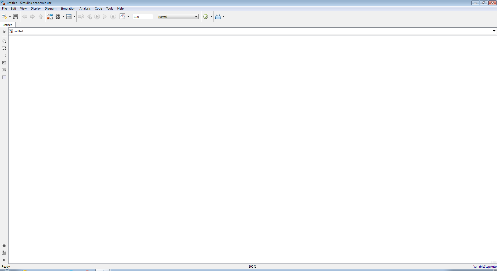
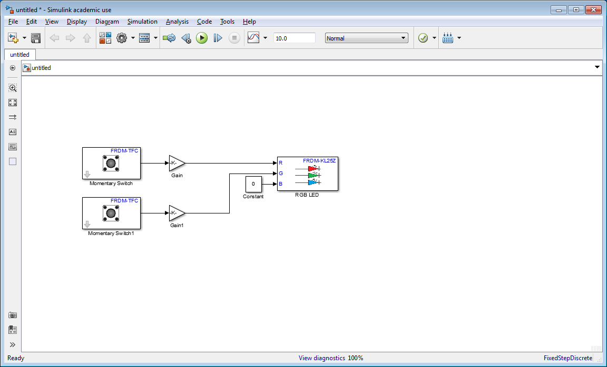

Simple tutorials to get started
===============================

This is a set of tutorials on how write simple examples in Simulink and load them on the Freescale board.

Prerequisites
-------------

* You have already installed Matlab and Simulink.
* You have already installed the Freescale board as it has been explained in a previous tutorial.
* If you need a general introduction to Simulink you have find a Interactive Simulink Tutorial `here <http://www.mathworks.com/academia/student_center/tutorials/slregister.html>`__.

Playing with the RGB Led
------------------------

1. Plug the Mini USB cable from the Freescale board to a USB port on your computer.

.. figure:: Pictures/06-1_connect.jpg
  :figclass: align-center

  Connect the board to your computer

2. To start writing you first program you have to open MATLAB, select HOME > New > Simulink Model.

.. figure:: Pictures/06-2_new.png
  :figclass: align-center

  New Simulink Model

3. What you see now is an empty Simulink Model. In this canvas you can drag and drop various "blocks" of code as we will see later, to program your board.

  Empty Simulink Model

4. To open the library that has all the available blocks of code go to Tools > Library Browser.
5. Here you see all the available code blocks to start writing your programs.

  The Simulink Library Browser

6. Our task is to play with the RGB Led that is on the Freescale board. We will write a short program that just lights the red led. Later on we will play with buttons too. But for now, drag the **Constant** block from the Simulink **Sources** library to your model. Set the value of **Constant** block to **255** by double clicking on it on the canvas.
7. Drag the **RGB LED** block from FRDM-KL25Z library to the model.
8. Connect the **Constant** block to the **R** input of **RGB LED** block.
9. Copy the **Constant** block to your model and set the value to **0**. Then connect the **Constant** block to the **G** input of **RGB LED** block.
10. Make one more copy the **Constant** block to your model and set the value to **0**. Then connect the **Constant** block to the **B** input of **RGB LED** block.
11. You should have something like :numref:`fig:model`. Now you are ready to upload your code to Freescale's board and see the RGB Led flash. In the next part we will do the needed configurations to make the uploading possible.

  RGB Led Flash

Configure and Run the Model on Freescale FRDM-KL25Z Board
---------------------------------------------------------

1. In your Simulink model, click on the **Configuration Parameters** button.

2. When the **Configuration Parameters** page opens up, navigate to **Hardware Implementation** pane.
3. Set the **Hardware board** parameter to **Freescale FRDM-KL25Z**.
4. On the **Target Hardware Resources** pane, Set the **Build action** to **Build, load and run** to automatically download the generated binary file on to the connected Freescale FRDM-KL25Z board.
5. Navigate to **Solver** pane and set the **Solver** to **discrete (no continuous states)**.
6. Click **OK**.
7. In your Simulink model, click the **Build Model** button on the toolbar. The model will now be deployed to the Freescale FRDM-KL25Z Board.

8. Observe that the RGB LED is set with RED color!

Examples with Buttons
---------------------

In this part we are going to see 3 different examples with buttons. You can get the button block from: Simulink Library Browser > Embedded Coder Support Package fro Freescale > FRDM-TFC Shield > Momentary Switch.

When you place Momentary Switch in Simulink, then you can choose which of the two buttons each block is going to refer to by double clicking on it.

:numref:`fig:example_1` shows a very simple example that uses two buttons to control two different colours on the RGB Led.

  Example 1

On our next example in :numref:`fig:example_3`, we use the same idea as :numref:`fig:example_2` but we increase the luminosity of the colours by adding a **Gain** block. When you place the **Gain** block in your canvas, double click on it and set the **Gain** property to **255** which is the maximum luminosity for your led.

  Example 2

In our last example we continue on the same logic as previously but we add a **Sum** block to add two different **Gain** blocks to give maximum luminosity only when both of the buttons are pressed. Of course you have to change the **Gain** property in both of your **Gain** blocks. In our example we used **100** for each one of them.

  Example 3
