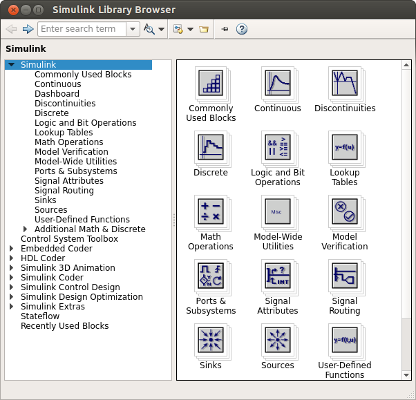
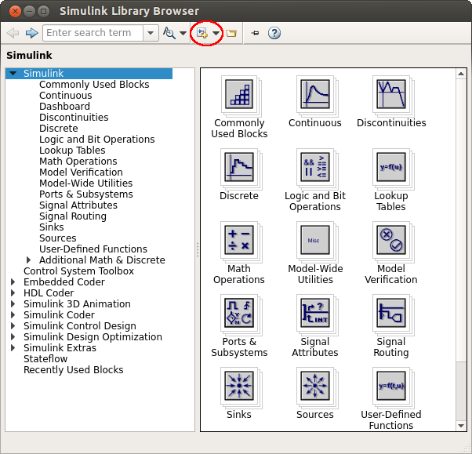
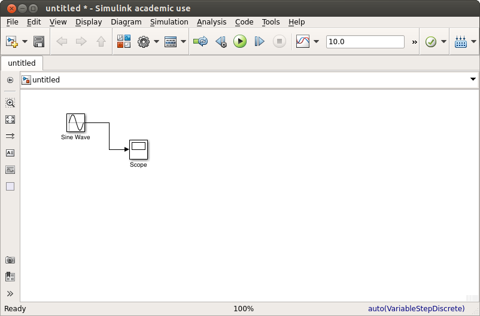
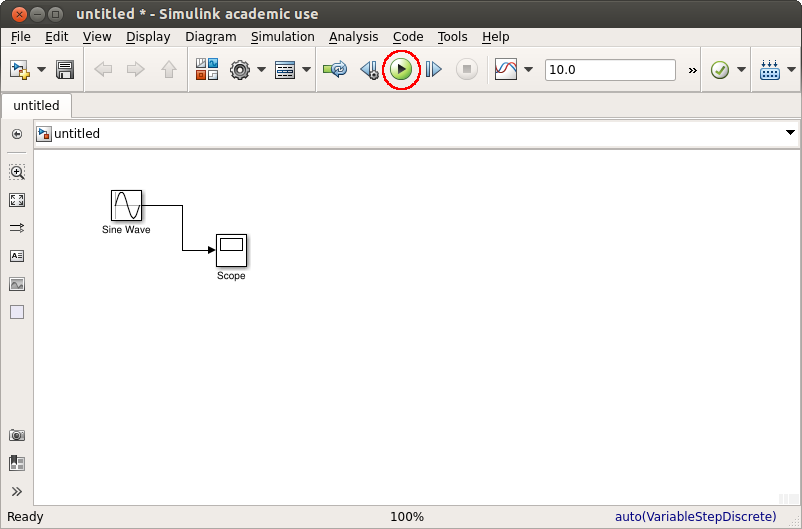
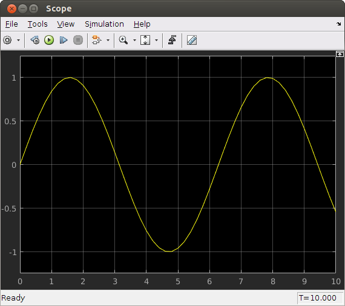

Introduction to Simulink
========================

Simulink, part of the Matlab suite, is a powerful tool used for multiple tasks, such as simulation or automatic code generation. In the Freescale cup, we will be using it, at first, to program our cars. Later on, we will have a look at how to simulate the way our car works, before actually using it in real life.

In order to familiarize ourselves with the environment, we will look at some basic examples of what Simulink can do.

A simple example
---------------

Writing a program in **Simulink** means composing it from pre-constructed blocks provided in the *Simulink Library Browser*. In order to launch the browser, at the Matlab command line, execute:

  ``>> simulink``

You can now see a window similar to the above image, which lists, by category, different blocks you could use in your program. To start off with a simple example, click the **New Model** icon.

We will start off by drawing the graph of the sine function. First, find the sine block in the library via one of the two following methods:

* Use the search option in the browser (the textbox containing *Enter search   term*) to look for *Sine Wave*, then hit Enter.
* Find the block in the **Sources** subcategory of the **Simulink** category.

After finding the correct block, drag it to our model. Similarly, find the *Scope* block (located in the **Sinks** subcategory) and add it to our model>

To finish our model, simply connect the two blocks, by clicking on the output of the *Sine Wave* block (the bold arrow on its right) and dragging the cursor to the input of the *Scope* block (the corresponding arrow on its left).

To see the result of our simulation (in this case, simply how a sine function looks like), first run it, either via the **Play** button at the top or by using the **Ctrl-T** key combination.

Finally, to see the actual result, double-click the *Scope* block and you will see the graph for a sine function.

Going further with Simulink
---------------------------

What we presented was a simple example to familiarise yourself with the bare basics of using Simulink to create a simulation. You needed to have some intuition regarding what the *Sine Wave* block actually meant (ie. it outputs signals representing a sine function) and might have used your intuition as to what the *Scope* block does (takes the input signal it receives and displays them).

To go further and build your own simulations, you will need to understand what it is you're trying to simulate, have knowledge about what the blocks at your disposal can do and how you can link them together to perform your desired action.

For more information regarding Simulink and some more examples, take a look at the following links:

* `Getting started guide <http://uk.mathworks.com/help/simulink/getting-started-with-simulink.html>`_
* `More Simulink examples <http://uk.mathworks.com/help/simulink/examples.html>`_
* `In-depth Simulink documentation <http://uk.mathworks.com/help/simulink/index.html>`_

