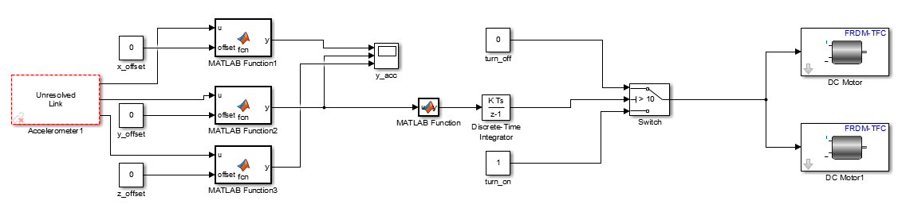
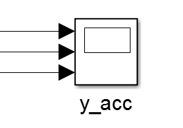
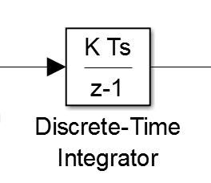
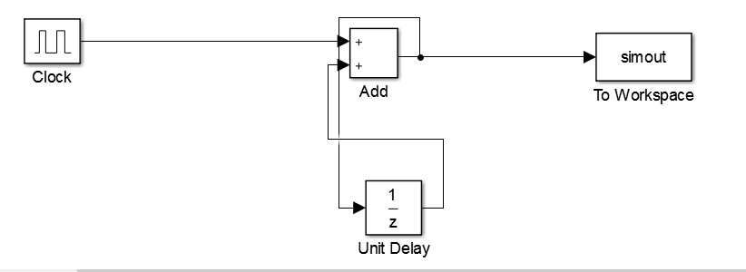

Testing
=======

Having completed the assembly and the programming of the car, it is essential to test the car to check its main functionalities. To achieve this, you can use the *Simulink External Mode* that facilitates testing without the need to build a full testing environment (i.e. assembled car/track). The *Simulink External Mode* is a fast and flexible way to test your applications since it provides the following benefits:

	1. **Signal acquisition**: It allows developers to capture and display signals from the real-time application while it is running. Signal data is retrieved from the real-time application and displayed in the same Simulink Scope blocks that were used to simulate your model.

	2. **Parameter tuning**: One can modify parameters in the Simulink block diagram while the application is running. New parameters are passed automatically to the real-time application. *Simulink external mode* alters parameters in the real-time application while it is running.

This mode enables the programmer to run the Simulink model on the car while it is linked to the computer, change the parameters of the model in real time and observe the effects of the model. It allows you to test individual modules without the need to assemble the track or the car.  

Simulink Model
--------------

The Simulink model used to test the application is depicted in :numref:`test_simulation`. You can find the model :download:`here <./accelerationTestUnit.slx>`. Its purpose is to measure the acceleration and the deceleration of the car.

The first block (Accelerometer 1) retrieves the measurements from the car's accelerometer. The measurements include acceleration values for the **x**, **y** and **z** axis. Due to the fact that these measurements are frequently noisy, we make use of constants (x_offset, y_offset, z_offset) to calibrate the accelerometer's values once the board is on the car. In particular, we subtract each offset from its corresponding original value retrieved from the accelerometer. For example we subtract the *y_offset* value from the acceleration obtained for axis y (i.e. acceleration(y)-y_offset). In the same way, we eliminate noise from the other two axes as well. This elimination is performed through the use of the three Matlab functions. The filtered accelerometer values are passed to the *y_acc* block that logs data to a file on your personal computer and creates plots with the three acceleraion values (see :numref:`plotting_block`). Data in the log files can be used for further analysis. 

Importantly, we feed the acceleration of the y axis to a *Discrete Time Intergrator*  (see :numref:`discrete_time_integrator`) that accumulates the input signal and makes an estimation of the car's speed. Obviously, this model works for setups where the car runs on a flat plane/straight line (since it *disregards* the acceleration values for axes x and z). Finally, we use a switch to turn-off the motors when the desired speed is reached. Naturally, as soon as the motors are turned off the car's speed decreases. In this fashion, the model can measure *both* the *deceleration* and the *acceleration* of the car.

The final requirement is to estimate the elapsed time between the moment when the car had a speed of zero and when the car reached the desired speed. To calculate this interval we created a *counter block*.  The counter block (depicted in :numref:`counter_block`) consists of:

	1. **A clock**: Its output is set to 1 for the first half of the period and 0 for the second half of the period.
	2. **A Unit Delay**: Its purpose is to store the current value of the sum.	
	3. **A counter/adder**: It adds its two inputs: (a) current value of the adder  and (b) the current value of the clock.

To summarise, the aforementioned counter block estimates the following values:

	1. Elapsed time between the moment when the car had a speed of zero and when the car reached the desired speed.
	2. Elapsed time between the moment when the car reached the desired speed and the moment when it stopped.

These two values are used to estimate the acceleration and the deceleration of the car.

Camera Measurements
-------------------

Finally to measure the car's performance you can measure the performance of each individual component of the car. In this section we will explain how to measure the performance of the car's camera. In particular we are going to measure the camera's aperture (i.e. how wide the camera is). There are two factors that affect the camera's aperture:

	1. **Height factor**: (with a range from 6 t 20cm) . We used a lego constructed ladder to move the camera to different heights (see :numref:`discrete_time_integrator`). We've tested the camera's aperture for various heights between the range 6 - 20cm. The height of the ladder was manually changed with the a ruler to move the camera to the desired height. Clearly, as the height of the camera increases, its aperture also increases.  
	2. **Camera angle**: We've tried a combination of different angles to measure the performance of the camera. Different angles correspond to different fields of vision. Generally, there is only need for four angles (0,30,60,90). All four angles were tested with different combinations of heights. 

Admittedly, the aperture of the camera is directly proportional to the height and the angle of the camera. We measured the camera's aperture for different combinations of heights and angles to evaluate the camera's performance. By having the camera connected to a desktop pc and through the *Simulink* software you can carry out the following experiment: Take two pieces of lego (or any other small object), one with your right hand and one with your left hand and close your hands until the two pieces of lego are in the camera's field of vision.
