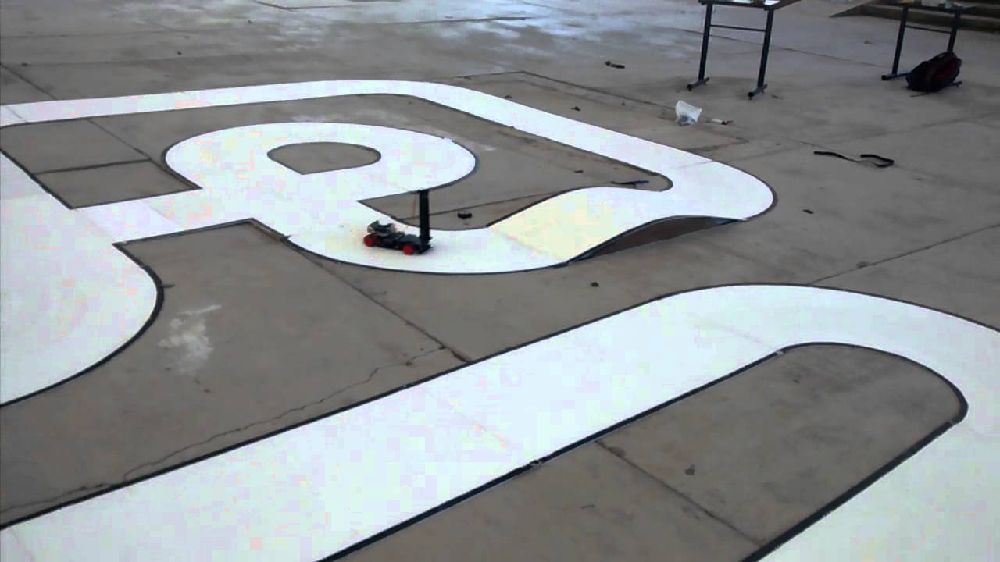

Testing
=======

Having completed the assembly and the programming of the car, it is essential to test the car to check its main functionalities. To achieve this, you can use the *Simulink External Mode* that facilitates testing without the need to build a full testing environment (i.e. assembled car/track). The *Simulink External Mode* is a fast and flexible way to test your applications since it provides the following benefits:

	1. **Signal acquisition**: It allows developers to capture and display signals from the real-time application while it is running. Signal data is retrieved from the real-time application and displayed in the same Simulink Scope blocks that were used to simulate your model.

	2. **Parameter tuning**: One can modify parameters in the Simulink block diagram while the application is running. New parameters are passed automatically to the real-time application. *Simulink external mode* alters parameters in the real-time application while it is running.

This mode enables the programmer to run the Simulink model on the car while it is linked to the computer, change the parameters of the model in real time and observe the effects of the model. It allows you to test individual modules without the need to assemble the track or the car.  

Simulink Model
==============

The Simulink model used to test the application is depicted in `-:numref:`hill_edge`  (PUT THE IMAGE HERE)

The first block retrieves the measurements from the car's accelerometer. The measurements include values for the acceleration on **x**, **y** and **z** axis. Due to the fact that these measurements are frequently noisy, we make use of constants (x_offset, y_offset, z_offset) to calibrate the accelerometer's values once the board is on the car. In particular, we subtract the three offsets from their corresponding original values retrieved from the accelerometer. For example we subtract the y_offset value from the acceleration obtained from axis y (i.e. acceleration(y)-y_offset). In the same way, we eliminate noise from the other two axes as well.

Importantly, we feed the y axis to a *Discrete Time Intergrator*  (image for the intergrator?) that accumulates the input signal and makes an estimation of the car's speed.
